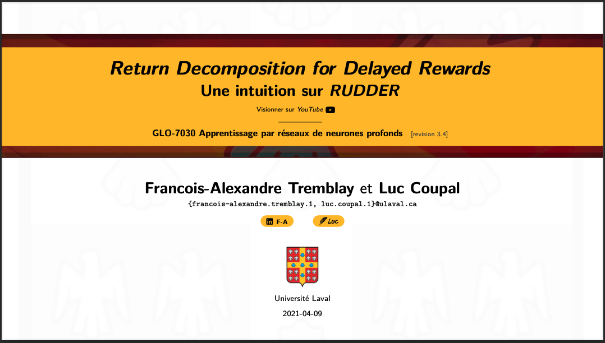
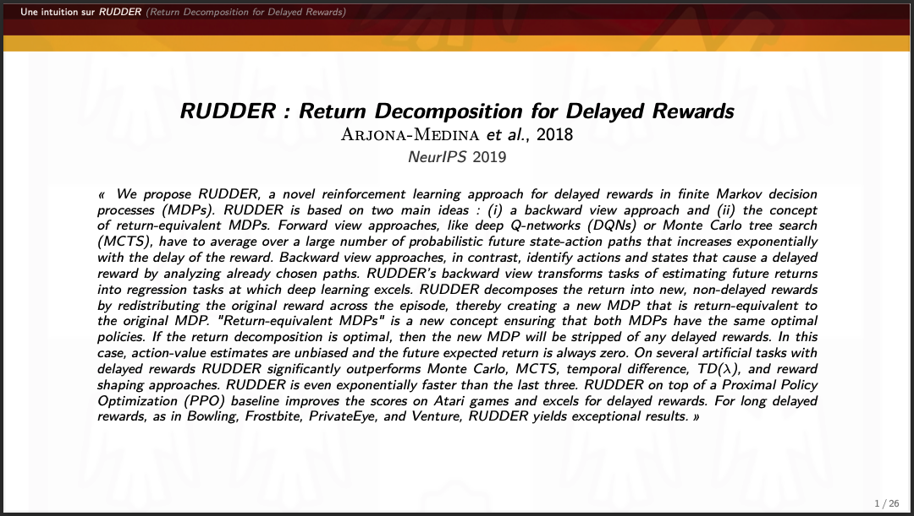
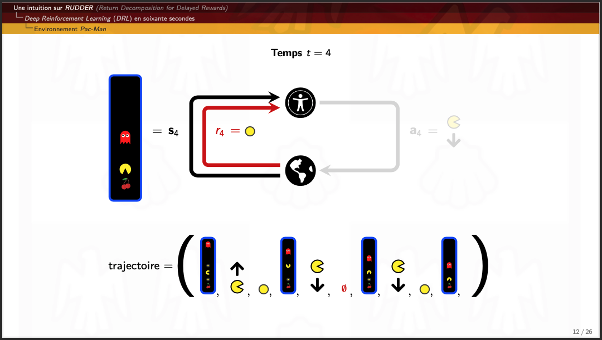
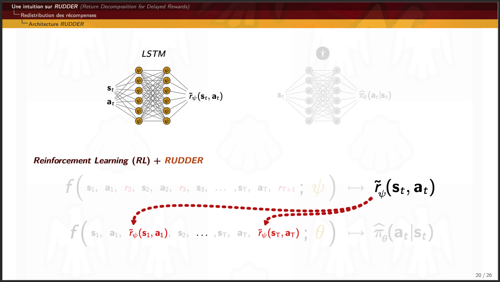

## Une intuition sur *RUDDER* (*Return Decomposition for Delayed Rewards*)
par [Luc Coupal](https://redleader962.github.io) et [Francois-Alexandre Tremblay](https://www.linkedin.com/in/francois-alexandre-tremblay-m-sc-2b212146/)

- Visionner sur ***YouTube***: [https://youtu.be/2xH1TjVt9I8](https://youtu.be/2xH1TjVt9I8)
- Télécharger les **diapositives**: [une-intuition-sur-rudder-v3-4.pdf](https://github.com/RedLeader962/une_intuition_sur_rudder/raw/master/une-intuition-sur-rudder-v3-4.pdf) (revision 3.4)

Présentation de l'article ***"RUDDER: Return Decomposition for Delayed Rewards"*** écrit par *Arjona-Medina, J. A.* et *al.* dans le cadre du cours **GLO-7030 Apprentissage par réseaux de neurones profonds** donné à l'[Université Laval](https://www.fsg.ulaval.ca), Qc, Canada.

 

 
test